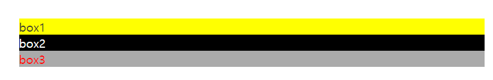

# Sass

>  CSS 작성(생성)을 위한 작고 가벼운 언어이고, Sass와 SCSS가 있다.


#### Sass

- SCSS와 구조적 차이가 있다. 작성이 번거롭고 복잡하다.

#### SCSS

- 기존에 알던 CSS와 유사하게 작성할 수 있다.


#### Sass 컴파일러

- `style1.scss` ---> Sass컴파일러 ---> `style1.css`

##### Sass 컴파일러의 종류

- VS Code + Live Sass Compiler
- Ruby Gem을 이용하는 컴파일러
- Node.js NPM을 이용하는 컴파일러


---

#### 주석

```scss
// 한줄짜리 주석도 가능

/*
 주석1
 주석2
*/
```


---


### Variables

- 변수에 사용하는 문자

- $ 로 시작하고 영문, 숫자 , `-` , ` _`  만 사용가능하다.

- 변수에는 모든 css 속성 값 들어갈 수 있다. (ex. `$var-name : block` 도 가능)


```scss
$bg-color: #fff;

body {
    background-color : $bg-color;
}
```


```scss
$color-white: #fff;
$color-black: #000;
$color-grey: #ccc;
$color-grey-light: #efefef;
$color-blue: #00f;

$border-color: $color-blue; // 변수안에 변수를 사용할 수 있다.


.title {
  color: $color-white;
  background-color:rgba($color-black, .5); 
  // background-color:rgba(0, 0, 0, .5) 와 같다.
}
```


----


### Nesting

- nest (둥지),  포함관계
- 코드내부가 너무 길어질 경우에는 꼭 nesting을 하기보다는  `.box1 .box2 { }` 로 작성하는 것이 보기 쉽다.


##### CSS

```css
#box1 {
    font-size: 30px;
    border: 3px solid #f00;
}
#box a {
    color: #a22;
    text-decoration: none;
}
```


##### SCSS

```scss
#box1 {
    font-size: 30px;
    border: 3px solid #f00;
    a {
        color: #a22;
        text-decoration: 
    }
}
```

---


##### CSS

```css
#box1 {
    font-size: 30px;
    border: 3px solid #f00;
    border-radius:20px;
}
#box > a {
    color: #a22;
    text-decoration: none;
}

#box > a : hover {
    color: #000;
}

#box-title {
     border-radius:20px;
}
```


##### SCSS

```scss
#box1 {
    font-size: 30px;
    border: 3px solid #f00;
    & > a {
        color: #a22;
        text-decoration: none;
        &:hover {
            color:#000;
        }
    }
    &, &-title { 
        border-radius:20px;
    } 
}
```

---


### Mixin

- 여러가지 css 속성들을 하나의 그룹으로 묶어서 여러 곳에 재사용

- 속성종류는 같은데 속성 값이 틀릴 때 하나의 그룹으로 정의해서 재사용이 가능하다.

```scss
// 아래 코드에서 font-size, background-color 속성 종류가 반복된다

#box1 {
  font-size: 40px;
  background-color: #ffcccc;
}

#box1 #box2 {
  font-size: 20px;
  background-color: #e9e9e9;
}
```


- 믹스인 키워드 :  `@mixin`
- 믹스인 이름 : 영문으로 시작하고 중간에 숫자, -(대시), _(언더바)가 들어올 수 있다. 
- 믹스인 변수 :  그 믹스인 블록안에서만 사용 가능하다.
- 믹스인 사용 :  `@include`

````SCSS
// mixin 정의
@mixin fontSizeBgColor($fontSize, $bgColor) {
  font-size: $fontSize;
  background-color: $bgColor;
}

// mixin 사용
#box1 {
  @include fontSizeBgColor(40px, #ffcccc);
}
#box1 #box2 {
  @include fontSizeBgColor(20px, #e9e9e9);
}
````


#### Mixin 기본값 설정

```scss
// mixin 정의 : 기본값 설정
@mixin fontSizeBgColor($fontSize: 20px, $bgColor: #fff) {
  font-size: $fontSize;
  background-color: $bgColor;
}

// mixin 사용 : 인자가 없을 경우 기본 값을 쓴다.
#box1 {
  @include fontSizeBgColor();
}

```


```scss
// mixin example

@mixin width-height-padding($w, $h, $p){
  width: $w;
  height: $h;
  padding: $p;
}

// 가운데 정렬
@mixin pos-abs-center() {
  position: absolute;
  top: 50%;
  left: 50%;
  transform: translate(-50%, -50%);
}

@mixin pos-abs-center-horizontal(){
  position: absolute;
  left: 50%;
  transform: translateX(-50%);
}

@mixin pos-abs-center-vertical(){
  position: absolute;
  top: 50%;
  transform: translateY(-50%);
}
```


---


### Extend

- 완전히 똑같은 코드를 묶어서 재사용할 수 있다.
- mixin은 속성 종류는 같은데  속성 값이 다를 때 쓰고,  extend는 완전히 같은 코드를 중복하여 사용할 때 쓴다.


```scss
// 아래 속성들은 완전히 똑같이 반복된다.

#box1 {
  border-radius: 20px;
  border: 3px solid #f00;
  box-shadow: 0px 3px 11px 0px rgba(0, 0, 0, 0.75);
}

#box1 #box2 {
  border-radius: 20px;
  border: 3px solid #f00;
  box-shadow: 0px 3px 11px 0px rgba(0, 0, 0, 0.75);
}
```


##### SCSS

```scss
// extend 정의 : % 를 붙이고 이름을 쓴다.
%boxShape {
  border-radius: 20px;
  border: 3px solid #f00;
  box-shadow: 0px 3px 11px 0px rgba(0, 0, 0, 0.75);
}

// extend 사용 : @extend
#box1 {
  @extend %boxShape;
}

#box1 #box2 {
  @extend %boxShape;
}
```


##### Compiled CSS

```css
/* 두 요소가 하나로 묶여서 CSS로 변환된다.*/

#box1, #box1 #box2 {
  border-radius: 20px;
  border: 3px solid #f00;
  -webkit-box-shadow: 0px 3px 11px 0px rgba(0, 0, 0, 0.75);
          box-shadow: 0px 3px 11px 0px rgba(0, 0, 0, 0.75);
}
```


---


### Partials

- partial(부분적인)
- 범용적인 코드들을 묶어서 **별도의 다른 파일**로 나눠서 저장하고 그 파일을 나누어 쓸 수 있다.


#### Partial 파일 생성
- `_mixins.scss` 파일을 생성한다.
  - `_`(언더스코어)로 시작하는 scss 파일은 컴파일이 되지 않는다. 

##### _mixins.scss

````scss
@mixin fontSizeBgColor($fontSize: 20px, $bgColor: #fff) {
  font-size: $fontSize;
  background-color: $bgColor;
}

@mixin linkStyle($textColor, $textDeco) {
  color: $textColor;
  text-decoration: $textDeco;
}
````


##### test.scss

````scss
// _mixins.scss파일 불러서 사용하기
@import "abstracts/mixins";
@import "base/base"; // ex) 기본적 구조에 대한 scss

// 파일을 import할 때는 언더스코어, 확장자(scss)를 생략한다.

#test {
  @include fontSizeBgColor(40px, #999);
}
````


---


### if

- 경우에 따라 다른 스타일을 적용할 때 쓴다.


##### if.scss

```scss
@mixin textAndBgColor($textColor, $bgColor) {
  color: $textColor;
  background-color: $bgColor;
}

@mixin theme($mood) {
  @if $mood == 'light' {
    @include textAndBgColor(#333, #ff0);
  }
  @else if $mood == 'dark' {
    @include textAndBgColor(#fff, #000);
  }
  @else {
    @include textAndBgColor(#f00, #aaa);
  }
}

#box1 {
  @include theme('light');
}
#box2 {
  @include theme('dark');
}
#box3 {
  @include theme('ggg'); // 모든 경우가 아닐 때, else에 해당한다.
}
```


##### 결과



---


#### @content 

- mixin을 불러올 때  @include의 **중괄호 자리에 들어간 코드**가  mixin 함수의 `@content` 안으로 들어간다.


##### abstracts/_mixins.scss

```scss
@mixin mq($screen-width) {
  @if $screen-width == 'phone' {
    @media screen and (max-width: 600px){
      @content;
    }
  }
  @else if $screen-width == 'tablet-land' {
    @media screen and (min-width: 601px) and (max-width: 1200px) {
      @content;
    }
  }
  @else if $screen-width == 'desktop-big' {
    @media screen and (min-width: 1201px) {
      @content;
    }
  }
}
```


##### test.scss

```scss
@import "abstracts/variables";
@import "abstracts/mixins";

.box {
  @include mq('phone') {
    border: none; 
  } 
  @include mq('tablet-land') {
    border: 2px solid $border-color; 
  }
  @include mq('desktop-big') {
    border: 10px solid $border-color;
  } // 중괄호 자리에 들어간 코드가 @content 안으로 들어간다.
  
```

