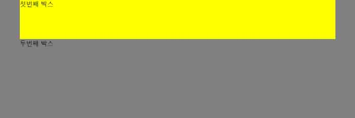
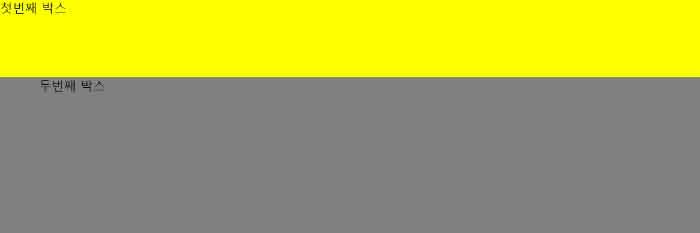

# 3/26 (월)

## 1. Today I learned

### 1-1. CSS Reset
  - 웹브라우저는 자체적으로 default stylesheet를 내장한다.
  - chrome : user agent stylesheet
    ```
    ul, menu, dir {
      display: block;
      list-style-type: disc;
      -webkit-margin-before: 1em; /* margin-top */
      -webkit-margin-after: 1em; /* margin-bottom */
      -webkit-margin-start: 0px; /* margin-left */
      -webkit-margin-end: 0px; /* margin-right */
      -webkit-padding-start: 40px; /* padding-left */
    }
    ```
- normalize.css
  - agent style이 브라우저 마다 다르므로 style-normalizations를 위해 생겨난 초기화 css
  - [cdn - noramlize.css](https://cdnjs.com/libraries/normalize)
  - css 윗줄에 써야한다. (css는 위에서 아래로 파싱하기 때문)

- reset.css
  - normalize.css는 브라우저차이를 없애주는 거라면
reset은 필요에 따라 초기화

- 코드작업을 하며 필요할 때마다 해당 태그에 초기화 - > 성능이 좋다.


### 1-2. CSS Font 
#### font-family
```
font-family:Arial, Helvetica, sans-serif;
```
- Arial : 1순위 글꼴 이름
- Helvetica : 2 순위 글꼴 이름
- sans-serif : **글꼴 군**, 각 운영체제가 지원하는 san-serif 계열 중에서 기본 글꼴 ( 삐침이 없는 돋움체 같은 폰트로 모바일 디바이스같은 작은 디바이스에서 가독성이 좋다.)

#### Web font
```
@font-face {
  font-family: 'Noto Sans Regular';
  font-style: normal;
  font-weight: 400;
  src: local('Noto Sans Regular'), local('NotoSans-Regular'), 
  url('font/eot/NotoSansKR-Regular-Hestia.eot'), 
  url('font/eot/NotoSansKR-Regular-Hestia.eot?#iefix') 
  format('embedded-opentype'), 
  url('font/woff/NotoSansKR-Regular-Hestia.woff') format('woff'), 
  url('font/otf/NotoSansKR-Regular-Hestia.otf') format('opentype');
}
```
- font-family : 마음대로 설정가능, 원하는 태그의 선택자 안에 선언한다.
- font-style : 폰트의 스타일을 normal(보통), italic (기울임꼴) 설정가능하다.
- font-weight : 100 ~ 900, Regular는 보통 300, 350, 400 인데 글꼴에 따라 다르다.
- src(source) : 브라우저마다 지원하는 글꼴 형식이 다르다. (eot, woff, otf)

### 1-3. CSS의 겹침과 상속
```
<user agent stylesheet>

a:-webkit-any-link {
  color: -webkit-link; 
  /* 크롬의 기본 링크 색상 변수 : 파란색 */
  cursor: pointer;
  text-decoration: underline;
}

====================================

<style.css>

body{
  color:#181818;
}

a{
  color: inherit; /* #181818을 상속 */
  text-decoration: none;  
}

```
- a태그의 color (글자 색상)은 상속된다.
- 상속받은 값, 내가 가진 값이 있으면 상속받은 값은 무시되고 내가가진 값이 우선된다.
- background는 상속되지 않고 기본값이 transparent이다.
- border는 상속이 안된다. 대부분 배치에 대한 것들은 상속되지 않는다.

### 1-4. 숨김 컨텐츠
- 구조상 존재하지만 화면 상에 보이지 않도록 한다. 
- `display:none`과 `visiblity:hidden`은 스크린 리더에서 읽지않으므로 권자하지 않는다.
- 숨김 처리 방법
    ```
    legend, .a11y-hidden {
      /* readable-hidden */
      width: 1px;
      height: 1px;
      overflow: hidden;
      margin: -1px;
      position: absolute;
      clip: rect(0,0,0,0);
    }
    ```
### 1-5. Negative Margin
- padding은 음수값이 사용불가능하지만 margin은 가능하다.
- 음수마진을 이용하면 컨텐츠 영역의 너비가 늘어난다. 상자의 자체 width가 늘어난다.
1. 첫번째 박스가 `marign:0`일때  (첫번째 박스의 너비: 800px)



2. `margin: 0 -50px` 추가 (첫번째 박스의 너비: 900px)




### 1-6. 접근성
1. 네이티브 방식
    - header, nav, main
2. WAI-ARIA
    - 역할모델을 의미하는 role이라는 속성 (ex. 
role = "banner" / role = "main")
    - 음성 브라우저가 랜드마크 단위로 탐색한다.
    - 내가 네비게이션으로 가고 싶으면 바로 감 (사용성이 좋아진다.) 
      ``` 
      <input aria-label="검색어" type="search" id="search" required placeholder="검색어를 입력하세요.">
      ```
    - label 태그 대신에 input 안에 aria-label로 레이블링 가능

### 1-6. Float
#### float
- float는 normal flow(일반적인 흐름,선형화)를 벗어나서 떠있는 개체
- 부모 영역을 기준으로 left, right 두가지 방향으로 부유한다.
- float된 엘리먼트는 부모 엘리먼트의 높이에 영향을 주지 않는다.
- float한 개체는 block요소

#### float 해제
- float된 자식 엘리먼트의 높이를 부모 엘리먼트에 반영하도록 대응하는 방법

- clear: float이 더 이상 주변 엘리먼트의 배치에 영향을 미치지 않도록 해제시키는 속성

1. float에 float으로 대응하는 방법
    - 부모에게 float을 주면 부모가 자식의 높이 값을 반영하지만
 부모의 너비가 줄어들어 권장하지 않는다.

2. float에 overflow 속성으로 대응하는 방법
    - 부모에게 overflow: hidden 혹은 scroll 등을 주면 부모가 자식의 높이값을 반영한다. 하지만 float된 개체의 영역이 부모의 영역을 넘어서면 보이지 않기 때문에 권장하지 않는다.

3. 빈 엘리먼트를 만들어 clear하는 방법
    - float한 개체의 부모가 끝나기 직전 빈 엘리먼트를 만들어 clear:both 속성을 부여해서 부모가 자식의 높이를 인식하도록 하는 방법이다. 하지만 의미 없는 빈 엘리먼트의 사용으로 권장하지 않는다.

4. 가상 선택자로 clear하는 방법
   - float한 개체의 부모에 가상 선택자 ::after를 만들어 float을 clear한다. clearfix기법이라고 불리며 권장하는 방법이다. clear는 block 요소에서 효과가 있으므로 display:block을 한다.
    ```
    .clearfix::after{
      content:"";
      clear: both;
      display: block;
    }
    ```

## 2. Today I found out
그동안 기계적으로 외워서 쓰던 코드들이 있었는데 숨김처리css와 float의 clear였다. 한줄 한줄 코드의 의미를 살펴보니 왜 이 코드를 사용해야하는지 이해할 수 있었다. 
당연히 이 코드를 쓴다는 생각을 의심해보는 습관을 가져야겠다.


## 3. 오늘 읽은 자료
[Understanding the CSS clip property](https://tympanus.net/codrops/2013/01/16/understanding-the-css-clip-property/)

[float을 clear하는 4가지 방법](http://naradesign.net/wp/2008/05/27/144/)

[webflow - flexbox game](https://preview.webflow.com/preview/flexbox-game?preview=d1a26b027c4803817087a91c651e321f&m=1)