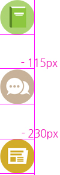

# 4/2 (월)

## 1. Today I learned

### 1-1. Form요소 

- html에서 가장 변화가 큰 부분은 form 요소이다.

- 대체텍스트,  form의 label로 접근성을 고려한다.

- html5부터 form태그 자체에 내장된 기능으로 서버에 보내기 전에 클라이언트단에서 필수항목을 체크해서 효율적이다. (과거에는 스크립트 처리하다보니  서버에 요청을 자주해서 비효율적)

- html5부터  form 태그와 submit버튼이 떨어져 있어도 form의 id와 button의 form속성에 같은 값을 주어서 연결시키는 것이 가능해졌다.

- [web form 2.0 demo](https://www.miketaylr.com/pres/html5/forms2.html)

  ​


#### input요소 - type 속성에 따라 서식의 종류가 달라짐

- ```
  <input type="text" maxlength="6">
  ```
  - 텍스트 한줄 입력상자
  -  `maxlength `: 최대 입력글자 (chararter 단위 한국,영문글자 상관x ) 만약 minlength 하고싶으면 스크립트처리해야한다.

- ```
  <input type="search" autofocus list="search-suggestions">
  <datalist id="search-suggestions">
      <option label="DM" value="Depeche Mode">
      <option label="Moz" value="Morrissey">
      <option label="NO" value="New Order">
      <option label="TC" value="The Cure">
  </datalist>
  ```

  - 검색어 입력상자 sematic하게 검색어를 알림 , 구브라우저에서는 자동으로 text로 바뀜
  - `datalist` 태그  
  - `option` 태그 
    - `label` 속성 
    - `value` : label을 더 구체적으로
  - `input type="search"` 의 list속성과   `datalist` 의  id를 같게 맞추기
  - 화살표 클릭하면 옵션태그에 나오는 것 선택가능, 자동완성 기능과 비슷하다.

- ```
  <input type="tel" pattern="[0-9]{10}" name="tel" title="Phone Number?!?!">
  ```

  - desktop에서는 의미 x , 모바일에서는 입력시에 키패드가 **숫자키패드** 만 올라옴 (사용자경험 좋아짐)

  - `pattern` 속성 : 정규표현식으로 간결하게 작성 

  - `name ` 속성 : form에 있는 데이터를 서버로 보낼때 저장될 필드의 이름, 데이터베이스 연동할 때 많이 쓴다.

  - `title`  속성 : 보조설명,  툴팁으로 이름 나옴 , label에 대한 설명을 쓰면 암묵적인 labeling으로 사용하기도 함

    ---

    **Labeling**

    - 명시적 레이블링 : label 태그와 input태그로 연결 (권장)
    - 암묵적 레이블링 :  label태그 내부에 input이 포함된 경우, ui배치의 제약 권장x / 국내지침에서만 하용하는 label 태그가 없고 input만 있을때 input에 title로 레이블링 

- ```
  <input type="password" placeholder="Password">
  ```

  - 클라이언트환경에서 암호를 보이게 하려면  암호보기체크를 누르면 password가 text로 바뀌게 스크립트 처리하면 된다.
  - `placeholder` 속성: 입력값에 대한 힌트를 제공한다.

- ```
  <input type="url" id="url" name="earl" required>
  ```

  - `required` 속성: 논리속성 (속성명만 명시함)으로 필수로 기입해야한다.
  - 사용자에게 url을 요청할때 쓴다.

- ```
  <input type="email" placeholder="foo@bar.com">
  ```

  - 중간에 @가 있는 이메일 형식으로 작성하도록 한다. submit을 해서  이메일타입이 아니면 경고가 나타난다. (브라우저 단에서 서버에 보내기 전에 알려줌)  경고 메세지는 브라우저가 국가별로 언어를 다르게 해서 알려준다.

- ```
  <input type="datetime">
  ```

  - datetime은 크롬이 지원 하지 않고 대신 text 타입으로 나온다.  (2018. 4.2 기준)

  - 날짜와 시간에 관련된 정보를 나타낸다.

- ```
   <input type="date">
   ```

   - date 캘린더 ui 
     - 키보드, 마우스 입력가능한 native component 이다. ( jQuery로 따로 캘린더를 사용하면 키보드로 컨트롤할 수 없음 ) 
     - native component의 단점은 디자인 커스터마이징이 어렵다는 것이다.
   - 지원을 많이 하지 않아서 브라우저에서 호환이 잘 되지 않는다. (2018. 4.2 기준)

- ```
  <input type="number" min="99" max="101">
  ```

  - min, max으로 최대,최소값을 정할 수 있다.

  - step으로 값을 주면 2 4 6 8 도 가능

- ```
  <input type="range" required name="range" />
  <output onforminput="value=range.value">0</output>
  ```
- range타입은 입력상자가 바 슬라이드 형태로 마우스로 조절 가능하다.
- output요소는  input값을 읽어서 output 금액이 출력되도록한다.
- output 에 onforinput은 크롬에서 지원하지 못한다.(Opera 브라우저전용) script로 input event를 통해 output값 변경할수 있다.

- ```
  <input type="color">
  ```
 ```
  - OS마다 native 팔레트가 다르다. 

- ```
   <input type="checkbox">
 ```
   - 체크박스, 브라우저별로 커스터마이징하기 까다롭다.

- ```
   <input type="radio">
   ```
   - 라디오버튼, 브라우저별로 커스터마이징하기 까다롭다. 

- ```
   <select>
     <option value="volvo">Volvo</option>
     <option value="saab">Saab</option>
     <option value="mercedes">Mercedes</option>
     <option value="audi">Audi</option>
   </select>
   ```
   - 커스텀 ui를 한다면 option을 키보드 화살표로 동작하게 해야한다. script로 키보드 인터렉션을 연결하게 해야한ㄷ.

- ```
   <input type="file" multiple />	
   ```
   - file : 클릭하면 탐색기가 뜨면서 파일 선택할 수 있다.
   - multiple :  파일 여러개 첨부가능하다.


### 1-3.  새소식 실습
#### HTML Markup
-  과거에는 embed태그, object태그로 flash를 재생하였다. 단점은 플래시 플레이어가 설치되어 있어야하므로 플러그인이 있어야해서 웹에서 바로 볼 수 없다는 점이다.
- `video`태그,  `audio` 태그,  `svg` 태그가 html5에서 추가되었다. 

#### video요소 
- 과거에는 브라우저마다 지원하는 동영상확장자가 달랐지만 최근에는 거의 모든 브라우저가 mp4를 지원한다. 오디오는 주로 mp3를  지원한다.

- `video` 태그는 안에 `source`태그(경로)와 `track`태그(자막파일)를 가질 수 있다.

- 제공할 비디오가 한개면 `video`태그에 src속성으로, 비디오가 여러 개면 `source`태그를 여러 개 작성하여  src 속성에 경로를 첨부한다. 

  - 비디오가 한 개일 경우

  	```
  	<video src="./media/stories.mp4" class="news-video" poster="./media/poster.jpg" preload="auto" controls>
  	```

  - 비디오가 여러 개일 경우

    ```
	<div class="news-container">
      <video class="responsive" controls="" poster="media/poster.jpg">
        <source src="media/google-developer-stories.webm" type="video/webm">
        <source src="media/google-developer-stories.mp4" type="video/mp4">
        <source src="media/google-developer-stories.ogg" type="video/ogg">
        <source src="media/google-developer-stories.mov" type="video/mov">
        <track src="media/google-developer-stories-subtitles-en.vtt" kind="captions" srclang="en" label="English Caption">
      </video>
    </div>
    ```


- `controls`속성 :  논리속성(*boolean 속성*)으로 control bar가 보이는지에 대한 여부를 설정한다.

- `autoplay` 속성 :   논리속성(*boolean 속성*)으로 되도록이면 자동재생을 하기보다는 사용자가 마우스 커서를 올렸을때 실행되게 하는 것이 좋다. 

- `poster`속성: 영상이 재생되기 전 맨 처음 이미지의 경로를 설정하는 것으로 설정하지 않으면 영상의 첫 장면이 나온다.

- `preload`속성 : 미리 영상을 다운로드가 되게하거나 아니면 나중에 로드할 수 있게 한다.

- `muted`속성 :  음소거를 true, false로 설정할 수 있다.

- `loop`속성 :  논리속성(*boolean 속성*)으로  반복재생이 되게 한다.

- `src` 속성:  삽입할 동영상의 경로를 설정한다.

```
<track src="./media/google-developer-stories-subtitles-en.vtt" kind="captions" srclang="en" label="영어 자막">
```

- `track`  태그 :  트랙 엘리먼트는 미디어 요소(`audio`,`video`)의 자식 요소이며, 외국어에 대한 자막, 장애인들을 위한 자막, 스크린 리더가 읽는 글을 비디오나, 오디오에 추가를 해줄수 있도록 한다. vtt의 파일 확장자 명을 가진다.

  - `label`속성:  브라우저가 사용 가능한 텍스트 트랙을 나열할 때 사용자가 읽을 수 있는 트랙제목이다.

  - `srclang `속성: 텍스트 트랙 데이터의 언어를 정의한다.

  - `kind` 속성: 텍스트 트랙의 종류를 정의한다.

  - `src` 속성: 자막의 경로를 설정한다. 

    ​

- 자막을 여러개 설정하는 것도 가능하다.

-  플레이어 하단 오른쪽의 cc버튼 클릭하면 자막을 on,off할 수 있다. 

- 자막 만드는 법

  ```
  00:00:02.500 --> 00:00:04.300
  and the way we access it is changing
  /* 
  시작 ---> 끝 언제부터 언제까지 
  자막내용 
  */
  ```
  - [mdn - vtt api](https://developer.mozilla.org/en-US/docs/Web/API/WebVTT_API)

  - 자막에도 css를 줄 수 있다.


#### time태그
``` 
<time class="new-date" datetime="2018-04-02T14:37:23"> 
```
- inline 요소	
- `datetime`은 필수속성으로 반드시 써야한다.
  - 형식은 [datetime="yyyy-mm-dd T hh:mm:ss"]  이다.

#### 반응형 개체 style
```
max-width: 100%; 
hegiht: auto; 
```


### 1-4. css sprite image 기법

- 아이콘은 img태그를 사용해도 되지만  대체텍스트가 없는 이미지이기  때문에 background 속성을 사용하여 배경에 이미지를 깔아주는 것을 권장한다. 

- CSS sprites 기법을 사용하면 여러 개의 이미지파일을 모두 부르는것이 아니라 한 이미지파일로 통합하여 부르게 된다.  따라서 서버와의 요청 횟수가 줄어들어 로딩속도가 줄어들고 내려받는 이미지의 용량이 줄어들어 효율적이다.

- 적용하는 방법은 아이콘들이 합쳐진 큰 이미지를 background-image로 배경을 설정하고, background-position 속성을 사용하여 좌표값을 조절하여 필요한 부분만 보이도록 한다.


#### HTML

```
 <h2 class="recommend-book-heading main-section-heading">추천 서적<span class="en-heading">Recommend Book</span></h2>

 <h2 class="news-heading main-section-heading">새소식<span class="en-heading">WebCafe News</span></h2>

```

#### CSS
```
/* 메인 콘텐츠 섹션 제목 공통 */
.main-section-heading{
  background-image: url("images/sprite_main.png");
  background-repeat: no-repeat;
}

/* 추천 서적 제목 */
.recommend-book-heading{
  background-position:0 0;
}

/* 새소식 제목 */
.news-heading {
  background-position: 0 -230px;
}
```

#### background-position 
: 위쪽으로 230px 만큼 이동한다.



### 1-4.  Icon Font
- 딩벳폰트는 폰트 대신 어떤 문자에 해당하는 이미지로 이루어진 폰트이다.
- **fontello**는 딩벳이나 아이콘을 폰트로 제공하는 여러 서비스를 모아둔 서비스이다.
#### fontello 사용법
1. [fontello](http://fontello.com/)에 들어가서 원하는 아이콘을 선택한다.
1. 선택을 마친후 오른쪽 상단에서 download 받는다.
1. 압축을 풀면 font 폴더와 css 폴더가 있는데 font 폴더를 복사하여 원하는 위치에 넣고 css폴더의 fontello.css의 코드를 원하는 위치에 넣는다.
1. 아이콘을 첨부하고 싶은 html 코드에 원하는 아이콘의 클래스명을 지정한다.
```
<ul class="fontello-list">
    <li class="icon-heart">아이콘폰트1</li>
    <li><i class="icon-glass"></i>아이콘폰트2</li>
    <li>아이콘폰트3<i class="icon-star"></i></li>
</ul>
```

[font awesome](https://fontawesome.com)도 아이콘 폰트가 가능하다.

    - acceesibility : aria-label labeledby 도 가능 / aria-hidden을 사용하면 스크린 리더가 읽지 않음

## 2. Today I found out
 아이콘을 나타내는 여러 방법을 알게 되었고 좀 더 편한 image sprites  기법도 사용해보고싶다.
